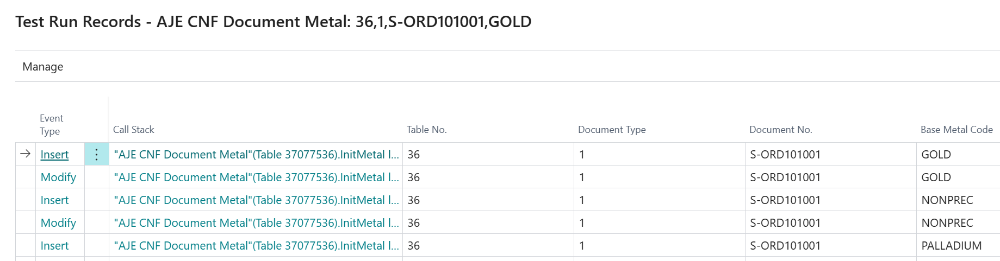
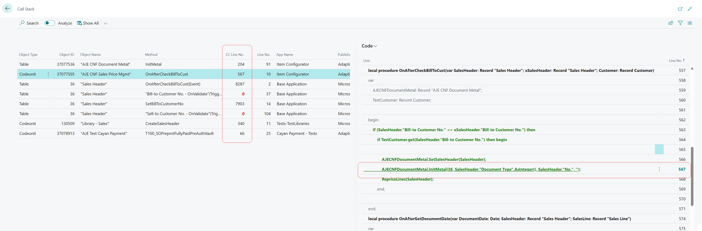
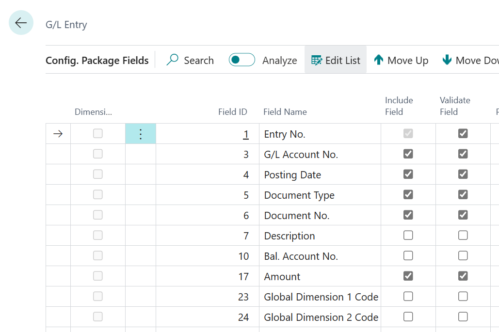

# Table Event Listener
Any scenario, manual or automated, can change the state of the database by changing data stored in tables. Even a simple scenario may touch multiple tables in a not easily predictable manner. Not to mention events that sometimes are very hard to be caught. 
This tool aims to help AL developers revealing all dark secrets hidden behind thousands of lines of code and confusing dependencies.

## Demo
Imagine a simple scenario: 
1. create a new customer with a name
2. set the phone number for it
3. delete it

We may assume that there must be at least three logged entries for the same `Customer` record, one per event: insert, modify, delete.

The demo will answer the question - what records are going to be touched.

## Collected data
The tool allows you to collect data about table records touched by the standard table events. As a result you get a list of entries that include:
 - event type (insert, modify, delete, rename)
 - record id of the touched record
 - call stack pointing to the moment of the record change
 - content of all (or selected) fields based on a chosen configuration package

### Data Analysis
Action `Show Data` opens the list of fields data for all records of the table in the current line:

> It can be exported to excel for further analysis.

### Call Stack analisys
Drill down on the call stack field will open a page, where each line of the call stack can be found in the `Code` section showing code coverage lines:
 

> The `Code` section is visible only if during the test run the code coverage tracking were enabled.

## Manual test run
Use the global search control to open `Listener Test Runs` page.

Here you see all test runs that were logged.

Run `+New` action to create a new manual test run.

Better put some words to the description field to find it easily later.

If you don't know what tables should be logged keep `All Tables` on. The package will be created automatically, but it will include events for (almost) all tables.

If you know exactly what you need, pick a configuration package in `Config. Package Code`.

You can edit the package by by changing the tables list and fields that are included. 

> By default when a table is added, all its fields are included. Better limit the list by drill down on `No. of Fields Available`

### Start the run
When the configuration package is defined or `All Tables` option is chosen, run action `Start`
It will:
- set autogenerated `Config. Package Code`
- change the status from `Created` to `Started`
- activate the logging. 

Now you can close the page. The tool is listening your actions.

### Complete scenario
Do all required manual steps, except running tests in `AL Test Tool` page

### Finish the run
Reopen page `Listener Test Run` and run action `Finish`
It will:
- deactivate the logging
- change the status from `Started` to `Finished`
- adds entries to the `Records` section

## Automated test run
Page `AL Test Tool` is extended, so you can enable the mode of collecting test results.

It adds three new fields to the test method line:
- `All Tables`
- `Config. Package Code`
- `Latest Test Run No.`

You can toggle `All Tables`, it will blank `Config. Pack Code`. The configuration package will be generated automatically during the test run by adding all tables that would be touched. 
> In `All Tables` mode the fileds data is not getting collected, as it can lead to a lot of data that is not needed.

You can rerun the test with this autogenerated package code, so it will collect fields data. Though it makes sense to remove tables that are not interesting from the package.

> The test line, where `Config. Pack Code` is blank and `All Tables` is off, will be executed as if logging is disabled

# Download  
Download the app file [AJETableEventListener-main-Apps-1.0.7.0](https://github.com/AdaptiveBS/AJETableEventListener/actions/runs/7560242778/artifacts/1176163381) 

